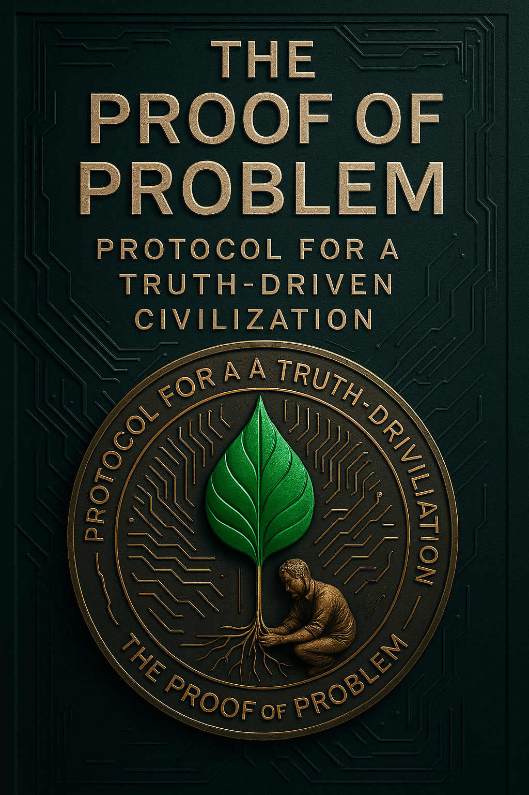

# 📘 Proof-of-Problem Protocol (PoPP)  
_The Protocol for a Truth-Driven Civilization_

---

## 🧭 Why This Project Exists

We live in an era overflowing with complaints, warnings, and disruptions—and yet, most of them vanish.  
They are lost in call centers, buried in bureaucracy, or ignored by systems too rigid to evolve.

But what if we stopped dismissing problems as noise?  
What if we treated every problem as a **proof**—a signal that something demands attention, validation, and change?

That is the question that gave birth to **PoPP**: the _Proof-of-Problem Protocol_.

---

## 🧠 What Is PoPP?

**PoPP** is a decentralized protocol that redefines how societies detect, verify, and escalate real-world problems.

It turns problems into structured, immutable data—so that:

- ✅ **Truth becomes trackable**  
- ✅ **Complaints gain credibility**  
- ✅ **Solutions are incentivized**  
- ✅ **Silence is no longer protection**

> _PoPP is not a tool for protest. It’s a framework for accountability._

---

## 🌐 Why It Matters

In a world flooded by misinformation and filtered feedback loops, we need systems that honor:

- **Transparency over bureaucracy**  
- **Validation over volume**  
- **Resolution over ritual**

PoPP offers a foundation for:

- 🏛️ Truth-driven governance  
- 🌍 Decentralized civic accountability  
- 🤖 Technological compassion

---

## 🔮 What This Repository Contains

This is the official repository for the **PoPP Book** and documentation.  
Here you'll find:

- 📖 Chapters explaining the philosophy and technical foundations
- 🧠 Diagrams and illustrations
- 🧪 Experimental prototypes
- 🛠️ Tools to explore or implement PoPP

---

## 📣 A Call to Builders

PoPP is a living idea.  
It invites you—developers, thinkers, designers, and civic hackers—to co-create the future.

> _Welcome to the Proof-of-Problem Protocol._  
> _Welcome to a civilization that listens._

---

## 📂 Chapters Available

- [📘 Introduction](./chapters/01-introduction.md)
- [📘 Chapter 1: The Origin of the Idea](./chapters/01-origin-of-the-idea.md)
- [📘 Chapter 2: What is a Problem? A Philosophical Inquiry](./chapters/02-what-is-a-problem.md)
- [📘 Chapter 3: From Complaint to Protocol](./chapters/03-from-complaint-to-protocol.md)
- [📘 Chapter 4: Why the World Needs PoPP](./chapters/04-why-the-world-needs-popp.md)
- [📘 Chapter 5: Understanding False Systems](./chapters/05-understanding-false-systems.md)
- [📘 Chapter 6: Truth, Trust, and Civilization](./chapters/06-truth-trust-and-civilization.md)
- [📘 Chapter 7: PoPP Core Architecture](./chapters/07-popp-core-architecture.md)
- [📘 Chapter 8: Validators and Proofers](./chapters/08-validators-and-proofers.md)
- [📘 Chapter 9: The Ticket](./chapters/09-the-ticket.md)
- [📘 Chapter 10: Escalation Mechanism and Truth Flow](./chapters/10-escalation-mechanism-and-truth-flow.md)
- [📘 Chapter 11: Problem State Lifecycle](./chapters/11-problem-state-lifecycle.md)
- [📘 Chapter 12: Tokenomics and the Reputation Layer](./chapters/12-tokenomics-and-reputation-layer.md)
- [📘 Chapter 13: Governance DAO and Jurisdictionless Justice](./chapters/13-governance-DAO-and-jurisdictionless-justice.md)
- [📘 Chapter 14: Use Cases Across Real-World Domains](./chapters/14-use-cases-across-real-world-domains.md)
- [📘 Chapter 15: Interoperability with Existing Systems](./chapters/15-Interoperability-with-Existing-Systems.md)
- [📘 Chapter 16: Memory Chain — The Archive of Civilization’s Pain](./chapters/16-emory-chain-the-archive-of-civilization-s-pain.md)
- [📘 Chapter 17: The End of Silence](./chapters/17-the-end-of-silence.md)
- [📘 Chapter 18: The Future We Can Prove](./chapters/18-the-future-we-can-prove.md)
- [📘 Chapter 19: Design Principles and UI of the Protocol](./chapters/19-design-principles-and-UI-of-the-Protocol.md)
- [📘 Chapter 20: Decentralized Infrastructure Stack of PoPP](./chapters/20-decentralized-infrastructure-stack-of-PoPP.md)
- [📘 Chapter 21: Threat Models and Attack Resistance](./chapters/21-threat-models-and-attack-resistance.md)
- [📘 Chapter 22: Real-World Simulation and Pilot Use Cases](./chapters/22-real-world-simulation-and-pilot-use-cases.md)
- [📘 Chapter 23: Philosophical Implications of Proof of Problem](./chapters/23-philosophical-implications-of-Proof-of-Problem.md)
- [📘 Chapter 24: Beyond Civilization — PoPP for Space, AI, and Post-Human Societies](./chapters/24-beyond-civilization-PoPP-for-Space-AI-and-post-human-societies.md)
- [📘 Chapter 25: The Roadmap — From Prototype to Planetary](./chapters/25-the-roadmap-from-prototype-to-planetary.md)
- [📘 Chapter 26: The Myth, the Movement, and the Memorial](./chapters/26-the-Myth-the-movement-and-the-memorial.md)
- [📘 Chapter 27: The Open Source Manifesto](./chapters/27-the-open-source-manifesto.md)
- [📘 Chapter 28: Designing the PoPP Constitution](./chapters/28-Designing-the-PoPP-Constitution.md)
- [📘 Chapter 29: DAO Governance and Upgradability](./chapters/29-DAO-Governance-and-Upgradability.md)
- [📘 Chapter 30: When PoPP Fails — Graceful Degradation and Crisis Protocols](./chapters/30-When-PoPP-Fails-Graceful-Degradation-and-Crisis-Protocols.md)
- [📘 Chapter 31: Cultural Adoption — Making Truth Beautiful](./chapters/31-Cultural-Adoption-Making-Truth-Beautiful.md)
- [📘 Chapter 32: Interoperability with Other Protocols](./chapters/32-Interoperability-with-Other-Protocols.md)
- [📘 Chapter 33: Education, Adoption, and Onboarding](./chapters/33-Education-Adoption-and-Onboarding.md)
- [📘 Chapter 34: Economic Incentives vs. Ethical Duty](./chapters/34-Economic-Incentives-vs-Ethical-Duty.md)
- [📘 Chapter 35: Local Adaptation — From Villages to Metaverses](./chapters/35-Local-Adaptation-From-Villages-to-Metaverses.md)
- [📘 Chapter 36: AI and the Ethics of Automated Judgment](./chapters/36-AI-and-the-Ethics-of-Automated-Judgment.md)
- [📘 Chapter 37: The Memorial Layer — Remembering Resolved Pain](./chapters/37-The-Memorial-Layer-Remembering-Resolved-Pain.md)
- [📘 Chapter 38: Resistance, Sabotage, and Protocol Immunity](./chapters/38-Resistance-Sabotage-and-Protocol-Immunity.md)
- [📘 Chapter 39: Building New Economies of Resolution](./chapters/39-Building-New-Economies-of-Resolution.md)
- [📘 Chapter 40: Global DAO Diplomacy and Truth Treaties](./chapters/40-Global-DAO-Diplomacy-and-Truth-Treaties.md)
- [📘 Chapter 41: The PoPP Constitution and DAO Amendments](./chapters/41-The-PoPP-Constitution-and-DAO-Amendments.md)
- [📘 Chapter 42: When PoPP Goes Wrong — Recovery and Forgiveness](./chapters/42-When-PoPP-Goes-Wrong-Recovery-and-Forgiveness.md)
- [📘 Chapter 43: The Cultural Evolution of Truth](./chapters/43-The-Cultural-Evolution-of-Truth.md)
- [📘 Chapter 44: The Role of PoPP in Conflict Zones](./chapters/44-The-Role-of-PoPP-in-Conflict-Zones.md)
- [📘 Chapter 45: Interfacing PoPP with International Law](./chapters/45-Interfacing-PoPP-with-International-Law.md)
- [📘 Chapter 46: The Lifespan of a Civilization in PoPP](./chapters/46-The-Lifespan-of-a-Civilization-in-PoPP.md)
- [📘 Chapter 47: Philosophical Foundations of the Protocol](./chapters/47-Philosophical-Foundations-of-the-Protocol.md)
- [📘 Chapter 48: Designing for the Next 1,000 Years](./chapters/48-Designing-for-the-Next-1000-Years.md)
- [📘 Chapter 49: Endgame Scenarios and Moral Reboots](./chapters/49-Endgame-Scenarios-and-Moral-Reboots.md)
- [📘 Chapter 50: The Final Validator](./chapters/50-The-Final-Validator.md)
- [📘 Chapter 51: A Love Letter to All Who Escalated](./chapters/51-A-Love-Letter-to-All-Who-Escalated.md)

---

## 🖼️ The Visual Cover?

  

