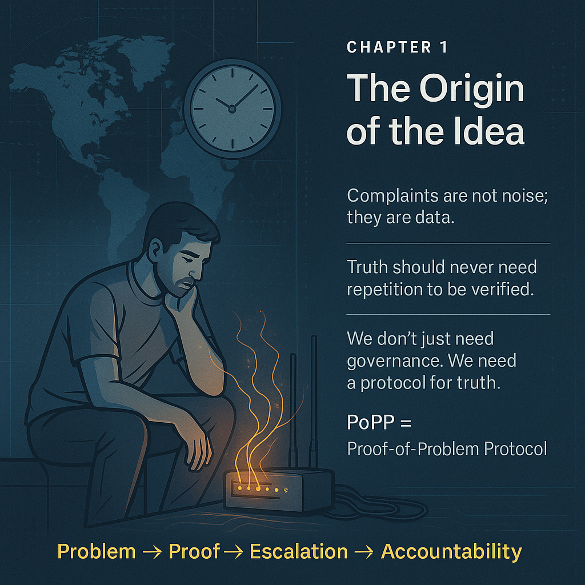

# 📘 Chapter 1: The Origin of the Idea

---


## ✍️ Narrative
<table style="border: none; border-collapse: collapse;">
<tr>
  <td style="vertical-align: top; border: none;"  width="50%" valign="top">

Every great invention begins with a simple inconvenience.  
Mine began with a disconnected wire.  

For weeks, my internet line was mysteriously cut—again and again.  
I’d call support. I’d raise complaints.  
Every time, the response was polite... and hollow:  
> “We’ll fix it by evening.”

Evening turned into night.  
Night turned into ritual.  
And the broken line returned like clockwork.


  </td>
  <td style="border: none;" width="50%" align="right">
    
  </td>
</tr>
</table>

**Why is the complaint system so fragile?**  
**Why does truth need repetition to be noticed?**

That single reflection led to the bigger realisation:  
> **Complaints are not just noise.**  
> They are data points—evidence that something is broken.

But in our world, complaints often vanish.  
They get lost in bureaucracy.  
They are filtered, delayed, suppressed, or manipulated.

There was no protocol to protect the truth of a problem.

---

## 🔍 A Problem Is a Signal

In our current systems, we wait for problems to get worse before we act.  
But what if we verified and elevated problems the moment they emerged?

### Imagine if:

- A road complaint triggered decentralised validation.  
- A safety hazard became immutable on a ledger.  
- A water leak report couldn’t be ignored because it was cryptographically logged.

That’s when I realized:  
**We don’t just need governance.**  
**We need a protocol for truth.**

---

## 🌱 From Problem to Protocol

I didn’t invent PoPP to attack institutions.  
I invented it to empower people—  
So no problem, no matter how small,  
could go unheard, unnoticed, or unverifiable.

The Proof-of-Problem Protocol wasn’t born in a lab.  
It was born in frustration.  
It was born in silence.  
And it was born to ensure truth can’t be dropped.

---

> 💡 **Pull Quote (for illustration):**  
> _“The real problem isn’t the broken line.  
> The real problem is that no one is accountable when it breaks.”_


---

## 🧠 Author's Reflection

You can include an optional reflection section at the end of each chapter like this:
- What inspired this moment?
- What deeper truth does it reveal?
- How does it connect to the core vision of PoPP?

---

## 💡 Suggestion:


```markdown
