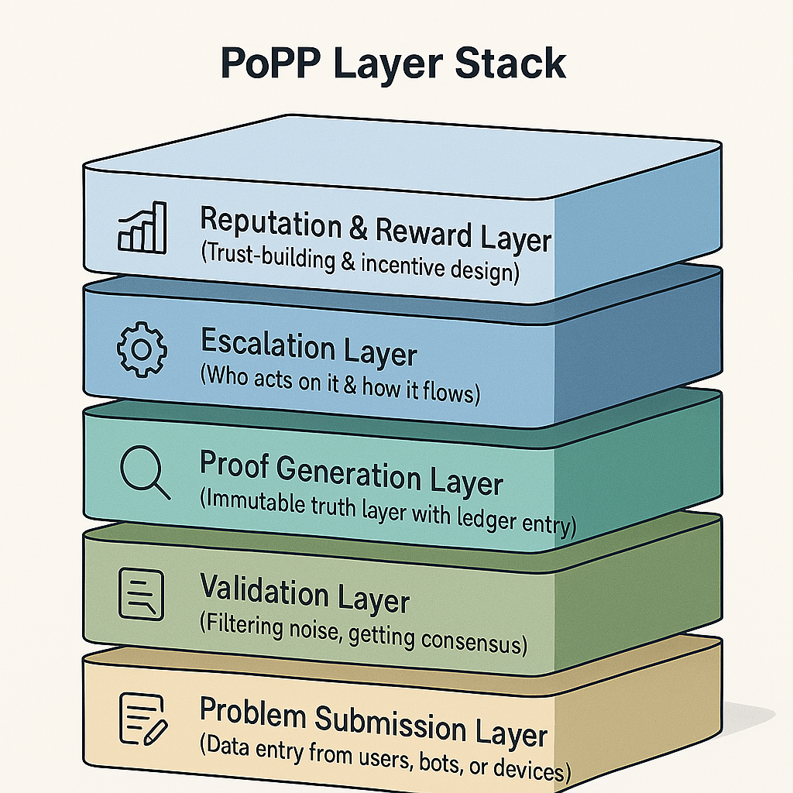
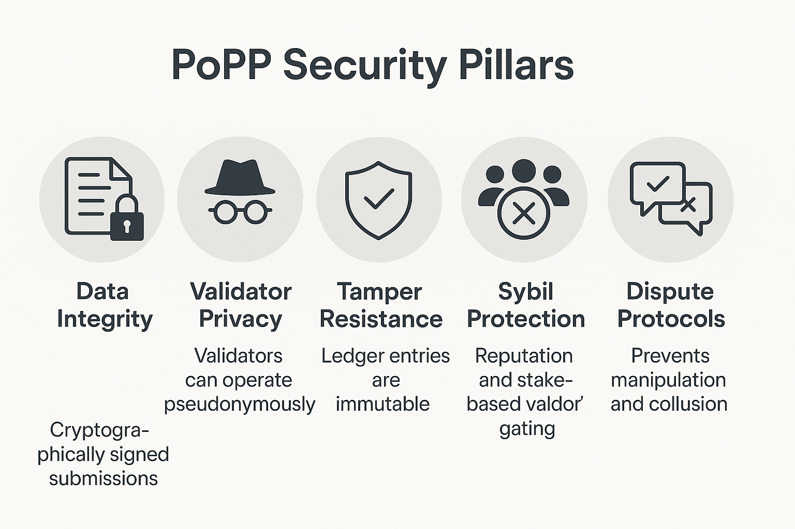
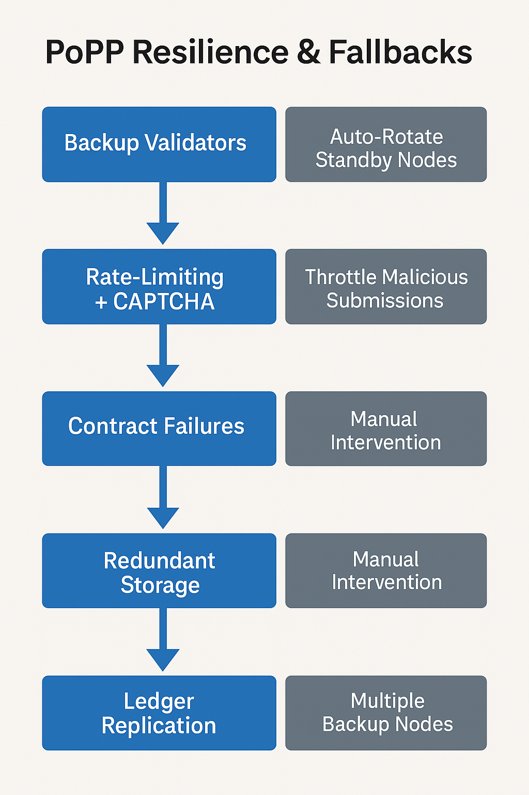
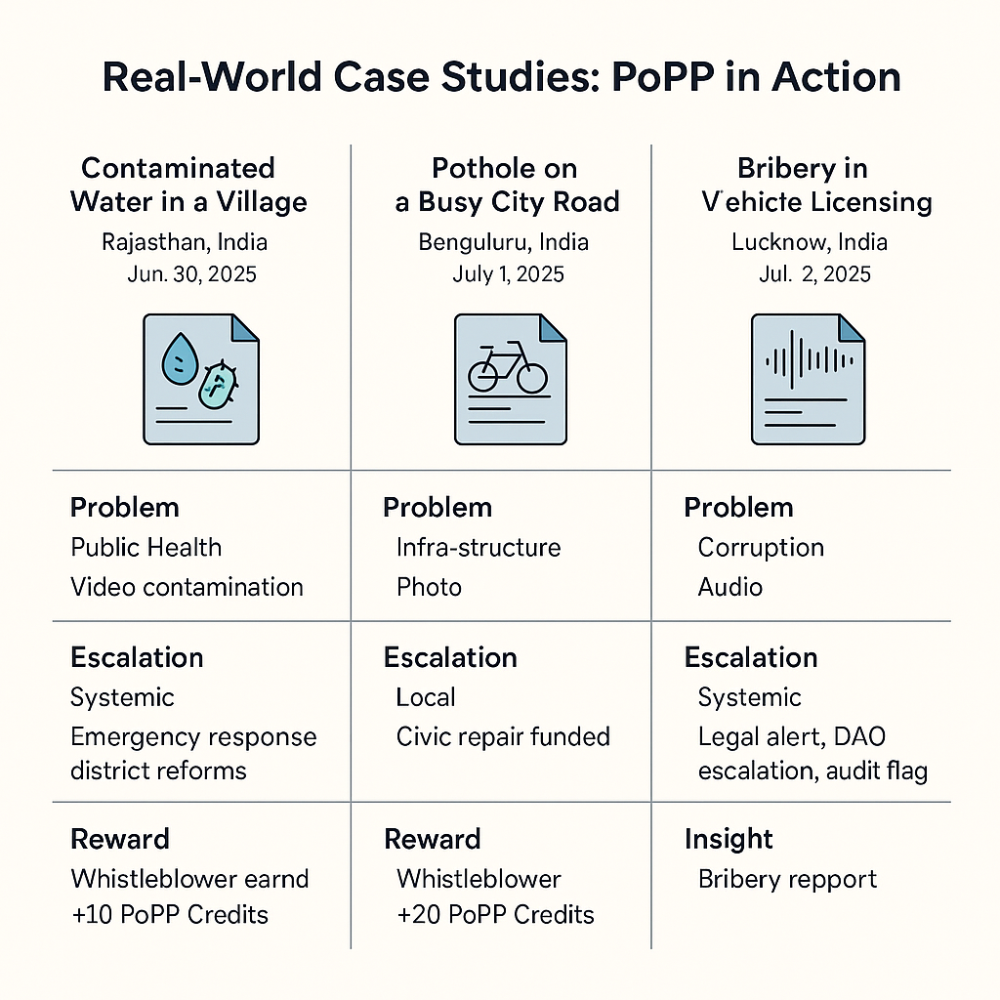

<!-- # 📘 Chapter 7: PoPP Core Architecture

---

## 🧠 What Makes a Protocol More Powerful Than a Platform?

A **platform** is built with **central control**.  
A **protocol** is built with **distributed trust**.

The **Proof-of-Problem Protocol (PoPP)** isn’t just software—  
It’s a **truth engine**:  
A layered system that **validates and escalates real-world issues**  
—without permission, without gatekeeping.

---

## 🧱 The 5 Core Layers of PoPP

### 1. 📝 Problem Submission Layer

- Users raise tickets through dApps (web, mobile, or voice-enabled kiosks)  
- Each complaint includes metadata:  
  `location`, `category`, `timestamp`, `optional evidence`  
- Identity can be **anonymous** or **verified**

---

### 2. 🔎 Validation Layer

- Validators (human, AI, or sensors) review the complaint  
- Context, reputation, and evidence are used to verify  
- A **minimum consensus score** is required to proceed  
- Disputes trigger **cross-verification**

---

### 3. 🔐 Proof Generation Layer

- Once validated, the issue is **cryptographically hashed**  
- It is written to a **distributed ledger** as a unique **PoP-ID**  
- Linked to similar past problems (to track recurrence)

---

### 4. ⚙️ Escalation Layer

- Issues are classified as:  
  - **Local** – handled by DAO/community department  
  - **Systemic** – escalated to broader levels  
  - **Critical** – triggers emergency protocols  
- **Smart contracts or DAO rules** dictate escalation flow

---

### 5. 📊 Reputation & Reward Layer

- Validators earn tokens or credits for **truthful validation**  
- **Bad actors** lose reputation or are penalized  
- **Whistleblowers** earn `PoPP Credits` or **Proof Respect Score (PRS)**

---

## 🔄 Lifecycle of a Problem Ticket

```text
[Submitted] → [Validated] → [Proven] → [Escalated or Resolved] → [Archived for Audit] -->
# 📘 Chapter 7: PoPP Core Architecture

# 🧠 What Makes a Protocol More Powerful Than a Platform?
A platform is a tool you use within boundaries.
A protocol is a rule of coordination—independent, interoperable, and trustless.

While platforms rely on central entities (corporations, admins), a protocol like PoPP allows anyone, anywhere to participate in identifying, proving, and resolving real-world problems, without prior permission.

**Example:** Twitter can censor a post. PoPP can’t censor a valid, proven problem—only escalate or resolve it.

PoPP is not a digital suggestion box—
It is a truth engine designed to unlock trust without borders.

# 🧱 The 5 Core Layers of PoPP – In Depth
## 1. 📝 Problem Submission Layer – The Origin Layer
**Role:** Acts as the “entry point” to the protocol.
Who can submit? Anyone — individuals, NGOs, AI agents, or community sensors.

### Supported Interfaces:

- PoPP dApps (mobile, web, desktop)

- Voice-enabled kiosks or IVR bots

- REST or GraphQL APIs for automated systems

### Data Captured per Ticket:

- UUID – Unique problem ticket ID

- Timestamp – UTC standardized

- Geo-location – GPS or network-based

- Category – From an evolving taxonomy (e.g., Health, Infrastructure, Crime)

- Optional Evidence – Image, audio, video, IoT sensor feed

**Identity Type:**

Anonymous (privacy-preserving)

Verified (linked to decentralized ID, biometrics, or social proof)

Security note: All metadata is signed locally before being sent to prevent tampering in transit.

## 2. 🔎 Validation Layer – The Gatekeeper Layer
Purpose:

Filter out noise, false submissions, or duplicates

Increase collective confidence via distributed review

### Validator Types:

**Humans:** Verified PoPP validators from the community or DAO

**AI Agents:** LLMs, CV/ML algorithms for image or audio verification

**Sensors:** Edge devices for water quality, traffic, noise, etc.

### Mechanisms:

**Contextual Scoring:** Based on issue type, evidence, urgency

**Reputation-Based Trust:** Validators with high PRS carry more weight

**Cross-Verification:** If validation is inconclusive, issue sent to more validators

**Consensus Algorithm:** Hybrid of PoS (proof of stake) + PoA (proof of authority)

**Validation Finality Rule:**
An issue must reach a minimum consensus score (e.g., 75% weighted trust) to progress.

## 3. 🔐 Proof Generation Layer – The Ledger Layer
Once validated, the issue enters the immutable world of cryptographic truth.

### Steps:

**Hashing:** Entire ticket content is hashed using SHA-3 or Poseidon (zk-friendly)

**Ledger Entry:** Added to the PoPPChain (or any PoPP-compatible blockchain)

### PoP-ID Assignment:

**Format:** pop://{timestamp}/{region}/{category}/{hash}

Each problem becomes a verifiable object with audit trails

### Linking Similar Proofs:

Historical patterns detected and grouped via semantic similarity or graph linkage

**Result:** Anyone can independently verify this problem exists in a tamper-proof log.

## 4. ⚙️ Escalation Layer – The Action Layer
Not all problems are equal. This layer is where decisions are made.

### Classification System:

**Local:** Can be resolved by nearby users or city DAO

**Systemic:** Requires organizational, institutional, or regional attention

**Critical:** Triggers alerts, sends to emergency DAOs or public dashboards

**Escalation Paths:**

Automated via Smart Contracts: Based on category + severity + validator agreement

**DAO Rulesets:** Each region or domain has its own escalation criteria

**Human Override:** In emergencies, trusted human agents can fast-track

### Actions Triggered:

Notifications to civic bodies

Payouts to whistleblowers

Public display on city dashboards

Data sent to UN, NGOs, or watchdogs via API

## 5. 📊 Reputation & Reward Layer – The Incentive Layer
Without incentives, trust breaks. This layer keeps the system alive.

### Key Metrics:

PRS (Proof Respect Score): A composite score for validators, whistleblowers, and resolvers

**PoPP Credits:** Utility tokens earned for positive contribution

**Slashing:** Validators lose reputation or credits for false validation

**Reputation Decay:** Inactive actors lose relevance over time

Special Roles:

**Whistleblower:** Gets bonus PRS for high-impact early reporting

**Resolver:** Volunteers or institutions that act on validated issues

Economic Design:

Token economy designed to reward early detection, accuracy, and impact

Credits can be used for governance, priority escalation, or even converted via DAO oracles

## 🔄 Lifecycle of a Problem Ticket – From Noise to Action
In a world overwhelmed by misinformation, negligence, and bureaucracy, the PoPP lifecycle offers a structured, decentralized path to transform raw complaints into verified actions.

This lifecycle isn’t just about logging problems—it’s about trust engineering. Each step progressively filters noise, amplifies truth, and delivers justice without central gatekeepers.

Let’s break down the lifecycle stages:

### 1. 📝 Submitted
This is the initiation point where a user, sensor, or AI submits a complaint to the system.
The submission can come through a variety of interfaces—mobile app, web portal, kiosk, or automated API.

### 📌 Core elements included:

Time, location, category of the issue

Optional media evidence

Anonymity or verified ID

This stage is intentionally open. Anyone, regardless of status or power, can signal a problem.

## 2. 🔎 Validated
Once submitted, the issue enters a crowdsourced and algorithmic filter. This is the phase where truth and trust intersect.

### 📌 Validation actors:

Human Validators (from the community or DAO)

AI systems (for evidence checking)

IoT sensors (as independent signal providers)

If validators reach the required minimum trust score, the ticket moves forward. If not, it may:

Be flagged for dispute or further verification

Be rejected and sent back with a reason

This is where noise is eliminated and truth is curated.

## 3. 🔐 Proven
Once validated, the issue is written as an immutable, tamper-proof entry on the distributed ledger. It now becomes part of the global PoPP memory.

### 📌 Key elements:

Hashed metadata and evidence

A unique PoP-ID for traceability

Links to similar or recurring issues in the past

At this point, the issue becomes a fact, not just a complaint. It can now no longer be ignored or altered.

## 4. ⚙️ Escalated or Resolved
Based on severity, category, and region, the system routes the proven problem toward the appropriate action track.

### 📌 Outcomes:

Local DAO handles simple issues

Systemic problems are flagged for wider visibility

Critical events trigger smart contracts or emergency DAOs

Issues with quick resolution go to verified solvers

This is where truth becomes transformation—either by direct resolution or by alerting higher-order actors.

## 5. 🗂️ Archived for Audit (Optional final stage)
Every resolved or escalated issue is recorded for future audits, policy feedback loops, or statistical analysis. This ensures institutional memory and transparency over time.

## 🌐 Why This Lifecycle Matters
✅ Resilience: Works even if parts of the system fail

✅ Scalability: Can handle thousands of tickets per second

✅ Equity: Gives voice to the voiceless without bias

✅ Integrity: Proves the truth before any action is taken

This lifecycle embodies the PoPP philosophy:
Everyone can report. Only truth progresses. Action follows proof.


**Figure:** *The Lifecycle of a Problem Ticket — From Submission to Action, as executed by the layered PoPP architecture*.

## 🔍 Visualization: PoPP Layer Stack
The PoPP Layer Stack isn’t just a technical hierarchy—it’s a philosophical design that turns individual complaint signals into collective civic intelligence. Each layer is modular yet interdependent, ensuring trust, transparency, and traction.

### 🔹 1. 📝 Problem Submission Layer
Foundation of the Stack – **“Input Layer”**

This is the entry gate into the PoPP system. It must balance openness with standardization. The goal is to ensure anyone, anywhere, can report an issue—while also collecting structured, actionable metadata.

#### Key Principles:
**Decentralized Access:** Anyone can submit; no gatekeepers.

**Multi-Modal Input:** Supports mobile, web, IoT, voice, and even anonymous agents.

**Metadata Integrity:** All data is signed and timestamped to preserve chain-of-custody.

**🧠 Design insight:** This layer is designed for high entropy — lots of different types of inputs, some good, some false. The upper layers filter signal from noise.

### 🔹 2. 🔎 Validation Layer
Signal Filtering Layer – **“Truth Gate”**

This layer determines whether a problem is real. It embodies collective intelligence—blending the judgment of humans, the pattern detection of AI, and the objectivity of sensors.

#### Core Mechanisms:
**Multi-source Verification:** At least two out of three (Human, AI, Sensor) should agree.

**Reputation-Based Weighting:** High-trust validators carry more weight.

**Dispute Handling:** If validators disagree, issues are sent for cross-checking.

**🔐 Design insight:** This is the truth discriminator. If the submission layer is the **“wildfire,”** this is the **“firewall.”**

### 🔹 3. 🔐 Proof Generation Layer
Ledger Anchor Layer – **“Truth Committed”**

This layer immortalizes validated issues by anchoring them into a distributed ledger. It transforms a complaint into a cryptographic proof of existence, giving it permanence and public accountability.

#### Features:
**Hashing:** Uses strong cryptographic functions to encode the problem.

**Ledger Entry:** Issues are stored in PoPPChain or compatible chains (e.g., IPFS + Ethereum).

**Issue Linking:** Similar issues are clustered for systemic pattern recognition.

**📚 Design insight:** Think of this as the library of unresolved truths—each entry is timestamped and cannot be retroactively changed.

### 🔹 4. ⚙️ Escalation Layer
Activation Layer – **“Where Truth Triggers Action”**

Validated and proven problems must now find resolution. This layer ensures that important problems don’t get lost. Instead, they are routed through smart contracts and DAO rules for appropriate handling.

#### Escalation Logic:
**Local Issues:** Sent to DAO or community response groups.

**Systemic Issues:** Forwarded to policy networks, regulators, or non-profits.

**Critical Threats:** Trigger alarms, public dashboards, or emergency smart contract execution.

**🧬 Design insight:** This layer encodes urgency + context → into programmable action. It brings justice without human bottlenecks.

### 🔹 5. 📊 Reputation & Reward Layer
Sustainability Layer – **“Behavior Engine”**

This final layer ensures that validators, whistleblowers, and resolvers are incentivized properly. It introduces game theory and economics into the protocol.

#### Key Metrics & Features:
**Proof Respect Score (PRS):** A transparent measure of trustworthiness and contribution.

**PoPP Credits:** Earned tokens for verified good actions.

**Slashing:** Bad validators are demoted or penalized.

**Governance Rights:** High scorers earn voting privileges.

**💰 Design insight:** This layer transforms participation into reputation capital, ensuring quality rises and bad actors are naturally weeded out.

#### 🧩 Why a Layered Stack Matters
This architecture is inspired by systems theory, where each layer performs a specialized task but also contributes to a larger goal: civic transformation.

**✅ Modular:** Each layer can be improved independently.

**✅ Composable:** Integrates with other protocols (e.g., Arweave, IPFS, Chainlink).

**✅ Auditable:** Every interaction across layers is logged and provable.

In PoPP, the stack isn't just technical—it's ethical.
Each layer reflects a deeper belief: that truth must be provable, action must be fair, and reputation must be earned.


**Figure:** The PoPP Layer Stack – A modular architecture illustrating the five foundational layers of the Proof-of-Problem Protocol: from decentralized problem submission at the base to reputation-driven incentives at the top, each layer plays a critical role in transforming raw complaints into verified, actionable truths.

## 6. 🔐 PoPP Security Guarantees
Ensuring Trust in a Trustless Environment

Security is not an afterthought in PoPP—it is engineered into every layer. In traditional systems, users must “hope” the system is secure. In PoPP, security is enforced by design, by math, and by decentralization.

The protocol assumes adversaries will attempt to manipulate, falsify, or overload it. Thus, PoPP uses a multi-layered security model built on cryptography, game theory, and distributed architecture to resist manipulation, fraud, and surveillance.

Below are the foundational pillars that uphold PoPP’s integrity:

### ✅ 1. Data Integrity
Every submitted problem is cryptographically signed by the origin device or user. This ensures:

Authenticity: Submissions are tied to a real origin

Tamper-proofing: No one can modify data mid-transit

Non-repudiation: Once submitted, the sender cannot deny it

Even anonymous submissions are assigned internal cryptographic fingerprints that can later link to reputation—without revealing identity.

### ✅ 2. Validator Privacy
To prevent bribery, blackmail, or undue influence, validators can operate pseudonymously. Their true identities are hidden, but their actions are traceable through their Proof Respect Score (PRS) and digital behavior.

This allows validators to:

Operate independently and securely

Protect themselves in sensitive escalations (e.g., corruption reports)

Maintain privacy while still being held accountable

### ✅ 3. Tamper Resistance
Once a problem is validated, its details are written to a distributed ledger, using hashing algorithms like SHA-3 or zk-friendly Poseidon. This makes the data:

Immutable — cannot be edited or deleted

Verifiable — anyone can check the ledger

Globally auditable — every citizen becomes a potential auditor

PoPP’s ledger doesn’t just record history—it locks it in place.

### ✅ 4. Sybil Attack Protection
In distributed systems, one danger is a user faking multiple identities (a Sybil attack) to manipulate validation outcomes.

PoPP counters this through:

Reputation-weighted consensus: Not every vote is equal—high-rep validators carry more weight

Stake requirements: Becoming a validator may require staking PoPP tokens

AI validator uniqueness scoring: Ensures AI agents are not cloned or manipulated

### ✅ 5. Dispute Protocols & Collusion Defense
Not all validators will agree—and some might even collude. PoPP has inbuilt cross-verification and dispute mechanisms to handle:

Conflicting verdicts

Suspicious majority patterns

False positives or false negatives

If a quorum is manipulated, issues are escalated for multi-actor cross-validation, where independent human, AI, and sensor validators re-assess the case.

This ensures truth is triangulated—not dictated.

### 🧠 Summary:
Security in PoPP is not about trust—it’s about verifiability without permission.
Every actor in the system—user, validator, resolver—is both empowered and accountable
through transparent, cryptographic, and game-theoretic design.


**Figure:** The five core security pillars of the PoPP architecture—Data Integrity, Validator Privacy, Tamper Resistance, Sybil Protection, and Dispute Protocols—ensure the system remains verifiable, fraud-resistant, and trustworthy at every layer.

### in short 
🔐 PoPP Security Guarantees
Data Integrity: All submissions are cryptographically signed

Validator Privacy: Validators can operate pseudonymously

Tamper Resistance: Ledger entries are immutable

Sybil Protection: Reputation and stake-based validator gating

Dispute Protocols: Prevents manipulation and collusion

✅ Shows your system is resilient to fraud and attacks.

### 🧯 System Resilience & Redundancy
How PoPP Stays Reliable in Unreliable Conditions

No system exists in a perfect world. Validators might go offline. Escalation contracts might fail. Malicious actors might flood the system with spam. PoPP is designed with fail-safes and fallback paths at every layer to ensure the system remains functional, secure, and trustworthy—even under pressure.

This section explains how resilience is embedded into PoPP’s core.

#### 🧑‍🔧 1. Backup Validators & Auto-Rotation
If a validator goes offline, becomes compromised, or fails to respond in time:

Backup validators from a standby pool are auto-rotated in.

Validators are selected using reputation-weighted randomization, minimizing bias or collusion.

Idle validators must heartbeat periodically to remain in rotation queue.

✅ This ensures that validation continues smoothly even when individual nodes fail.

#### 🧱 2. Smart Contract Failure Handling
If a smart contract responsible for escalation, rewards, or response fails to execute:

PoPP detects and logs the failure in a watchdog queue.

Human + AI fallback agents review and resolve the issue manually or through DAO vote.

Each contract is versioned and upgradable via governance vote to prevent systemic lockouts.

✅ This ensures that problems don’t disappear due to technical bugs or halted services.

#### 🚨 3. Spam & Abuse Protection
PoPP is open to the public—and that makes it vulnerable to attack. To prevent malicious overloads:

Rate-limiting: Submissions are throttled per IP or address during suspicious activity.

Reputation filters: Low-rep accounts have lower impact and may require CAPTCHA or stake.

CAPTCHA + Challenge-Response: Bots and scripted submissions must pass PoPP’s anti-spam layer.

Flood detection AI: PoPP uses anomaly detection to spot spamming patterns and isolate them in real-time.

✅ This makes PoPP spam-resilient without blocking valid whistleblowers or citizens.

#### 🧬 4. Redundant Storage & Ledger Replication
Problem data and ledger entries are replicated across multiple nodes and storage backends (e.g., IPFS, Arweave, on-chain).

In case one network or region goes down, others maintain access.

Validators also locally store temporary logs in encrypted format for extra redundancy.

### 🧠 Summary:
PoPP doesn’t assume everything will go right.
It prepares for what can go wrong—and builds fail-safes into truth.
That’s what makes it not just decentralized, but resilient by design.



**Figure:** The PoPP Resilience & Fallbacks Diagram – A layered flow showing how the protocol handles validator failures, spam attacks, contract errors, and data replication through automated rotation, manual interventions, and distributed redundancy mechanisms.


## 🧪 Case Study: A Real-World Problem Flowing Through the PoPP Stack
Let’s walk through how a real-world issue travels across all five PoPP layers—from submission to resolution.
# 🧾 Case Study 1: Contaminated Water in a Village

- 📍 **Location:** Rajasthan, India  
- 🕒 **Time:** 2025-06-30 10:12 AM IST  
- 📸 **Evidence:** Video of murky water, child coughing  
- 👤 **Identity:** Anonymous  
- **Category:** Public Health → Water Contamination

## 🔎 Validation Layer:

- **Human validator:** Public health worker confirms situation  
- **AI validator:** Analyzes murkiness and detects illness indicators  
- **IoT sensor:** Confirms high E. coli in well nearby  
- ✅ **Score:** 89/100 → Complaint validated

## 🔐 Proof Generation:

- **PoP-ID:** `pop://2025-06-30/rajasthan/water/abcde12345`  
- Linked to **6 past reports** → systemic cluster formed

## ⚙️ Escalation:

- **Type:** Systemic  
- **DAO triggers:**  
  - 🚰 Clean water airdrop  
  - 🧪 Lab testing  
  - 📢 Public alert

## 📊 Reward Layer:

- **Whistleblower:** +10 PoPP Credits  
- **Human validator:** +5 PRS  
- **AI validator:** Model updated  
- **District DAO:** Dashboard updated

---

# 🛣 Case Study 2: Pothole on a Busy City Road

- 📍 **Location:** Bengaluru, India  
- 📆 **Date:** 2025-07-01  
- 📸 **Evidence:** Photo of pothole + injury  
- 👤 **Identity:** Verified (via Aadhaar)

## 🔎 Validation Layer:

- **Citizen:** Confirms location  
- **AI:** Verifies image and GPS  
- **Traffic camera:** Shows 3 near-accidents  
- ✅ **Score:** 91/100 → Complaint validated

## 🔐 Proof Generation:

- **PoP-ID:** `pop://2025-07-01/bengaluru/infrastructure/pothole4512`

## ⚙️ Escalation:

- **Type:** Local DAO  
- **DAO allocates:** ₹5,000  
- **Civic dept notified:** 72-hour SLA

## 📊 Reward Layer:

- **Cyclist:** +6 PoPP Credits  
- **Validators:** Micro-rewards  
- **Civic dept:** Earns a transparency badge

---

# 🕵️‍♂️ Case Study 3: Bribery in Vehicle Licensing Office

- 📍 **Location:** Lucknow, India  
- 📆 **Date:** 2025-07-02  
- 📁 **Evidence:** Audio + scanned document  
- 👤 **Identity:** Anonymous (zk-proof)

## 🔎 Validation Layer:

- **Legal expert:** Verifies audio legality  
- **AI:** Detects corruption-linked speech patterns  
- **Match:** 4 previous reports from same office  
- ✅ **Score:** 87/100 → Triggers systemic flag

## 🔐 Proof Generation:

- **PoP-ID:** `pop://2025-07-02/lucknow/corruption/bribe_clerk23`

## ⚙️ Escalation:

- **Type:** Systemic  
- **DAO smart contract triggers:**  
  - Alert to ombudsman + media  
  - Legal team activated

## 📊 Reward Layer:

- **Whistleblower:** +20 PoPP Credits  
- **DAO:** Earns trust score  
- **Clerk’s office:** Flagged for audit

---

# 🌍 Collective Insight:

These diverse cases show PoPP’s wide applicability:

| **Issue Type**     | **Escalation Level** | **Outcome**                                      |
|--------------------|----------------------|--------------------------------------------------|
| Water Crisis       | Systemic             | Emergency response + district reforms            |
| Road Hazard        | Local                | Civic repair funded + reputation gains           |
| Bribery Report     | Systemic             | Legal alert, DAO escalation, audit flag          |

---

**PoPP turns problems into provable facts.**  
*It doesn’t matter who submits—it only matters what’s true.*




**Figure:** Real-World Case Studies of PoPP in Action – Three diverse examples showcasing how the PoPP protocol handles issues ranging from public health and infrastructure to corruption, demonstrating its flexibility across problem types and escalation layers.


### 🔍 PoPP vs Traditional Systems  
**A Side-by-Side Comparison of Trust, Transparency, and Transformation**

Understanding PoPP is only half the battle—comparing it with the systems it seeks to replace highlights just how radical and necessary this innovation is.

Traditional systems—whether civic complaint platforms, whistleblower portals, or municipal feedback forms—often suffer from opacity, delay, centralization, and corruption. PoPP counters these flaws with distributed architecture, programmable logic, and economic incentives.

Here’s a simple table contrasting the two approaches:

| **Feature**            | **PoPP**                                       | **Traditional Systems**                        |
|------------------------|-----------------------------------------------|------------------------------------------------|
| **Trust Source**       | Distributed Validators (human/AI/sensor)       | Centralized Authorities                        |
| **Openness**           | Anyone can submit (anonymous or verified)      | Often limited to official channels             |
| **Verification**       | Community + AI + IoT + cross-validation        | Manual or bureaucratic                         |
| **Ledger**             | Public, Immutable, Tamper-proof                | Private, Editable, Often Hidden                |
| **Escalation Logic**   | Smart Contracts + DAO Rules                    | Manual, Delayed, or Ignored                    |
| **Incentives**         | Tokens, PRS, Credits, Whistleblower Rewards    | Rare, sometimes punishment for reporting       |
| **Transparency**       | Open to audit at every layer                   | Often behind closed doors                      |
| **Data Provenance**    | Timestamped, Signed, Hashed                    | Editable, Unverified                           |
| **Dispute Resolution** | Multi-party + cross-verification logic         | Escalation delays or dead-ends                 |

---

## 🎯 Key Takeaways:

- 🔄 **PoPP shifts the center of gravity from bureaucracy to verifiability**  
- 🧠 **Every action in PoPP is logical, traceable, and replayable**  
- ⚖️ **Traditional systems often punish risk-takers; PoPP rewards truth-tellers**  
- 🧩 **This comparison illustrates that PoPP isn't just a better tool—it's a new paradigm**

## 🧠 Who Can Become a Validator in PoPP?
A Quick Guide to Validator Selection & Qualification

In PoPP, validators are the backbone of trust. They determine which problems are real, which are noise, and which demand escalation. But unlike traditional institutions where authority is granted top-down, PoPP allows any qualified participant to become a validator—as long as they earn it.

This section outlines how people, machines, or AIs are chosen and what qualifies them.

### ✅ Human Validators
Selection Criteria:

Must stake PoPP tokens to signal skin in the game

Must pass an onboarding quiz or training module

Must build reputation over time through consistent, accurate validations

Can be anonymous, pseudonymous, or verified

🧠 Validators don't need to be experts—they need to be honest, active, and community-trusted.

### ✅ AI Validators
**Eligibility Requirements:**

Must be open-source or audit-verified

Run in trusted enclaves or zero-knowledge containers

Must reveal model source + update logs

Trained on fair, explainable datasets (no black-box judgment)

🤖 AI agents can only act if they meet PoPP’s transparency and explainability standards.

### ✅ IoT / Sensor Validators
**Eligibility:**

Devices must be registered with metadata & calibration data

Must publish timestamped readings with cryptographic signatures

Participating sensors can be weather monitors, traffic cams, air quality devices, etc.

🌐 Physical validators help ground PoPP in objective, real-world signals.

🧬 Validator Classes & Governance Tiers
Validators may specialize and rank up based on category and reputation:

Local Validators: Focus on neighborhood or regional issues

Topical Validators: Specialize in specific domains (e.g., environment, education)

Meta Validators: Validate other validators’ behavior

Emergency Validators: Trained for high-risk, critical cases

### 📊 Reputation Drives Opportunity
**Validators are scored on:**

Accuracy (agreement with ground truth)

Speed

Consistency

Transparency in judgment (via commentary or logs)

**High scores unlock:**

💰 Higher rewards

📣 Governance voting rights

🛡 Access to validate critical or escalated problems

🧠 In PoPP, trust isn’t given—it’s earned, measured, and publicly visible.

📦 Plug & Play: PoPP’s Integration & Modularity
How Builders, Institutions, and Developers Connect to the Protocol

PoPP isn’t just a closed system—it’s a composable infrastructure layer meant to be extended, embedded, and plugged into external ecosystems. Whether you’re a civic app developer, a journalist, an NGO, or a DAO, PoPP offers clean ways to listen to, respond to, or build on top of real-world problems.

### 🔌 Integration Layer Components
Here’s how third parties can tap into PoPP's truth engine:

### 🌐 1. Webhook Support
Allow institutions or civic organizations to receive real-time alerts.

**Use Case Examples:**

Local fire departments receive auto-alerts from critical problem tags

NGOs subscribe to issues related to clean water or housing

Journalists subscribe to specific geo-tagged issues for leads

json
Copy
Edit
POST /webhook
{
  "category": "corruption",
  "location": "Mumbai",
  "score": "validated",
  "PoP-ID": "pop://2025-07-02/mumbai/corruption/bribe_case88"
}
### 📡 2. Public Data Feeds
Expose a live feed of all validated or escalated issues via GraphQL or REST APIs.

**Applications:**

Dashboards for local governance

Visualizations for civic engagement

Integrations with citizen reporting apps

graphql
Copy
Edit
query {
  problems(filter: {validated: true, region: "Asia"}) {
    id
    category
    timestamp
    severity
  }
}
### 🧩 3. Plugin Architecture for dApps & DAOs
Enable DAOs or apps to embed PoPP modules directly into their systems:

Embed a submission widget in civic portals

Trigger DAO actions based on incoming PoP-IDs

Automate token flows, bounties, or problem reviews

💡 Think: **“GitHub issues”** but for real-world problems, executable by DAOs.

### 🛠 4. Industry-Specific Modules
Support for sector-focused plugins:

**Healthcare:** Medical negligence complaints + hospital dashboard

**Education:** Broken infrastructure + transparency tracking

**Environment:** Pollution alerts + satellite data cross-validation

###  🧠 Extensibility Vision
**PoPP is built for:**

🌍 Governments and city councils

🤝 NGOs and humanitarian groups

🧑‍💻 Civic tech developers and startups

📢 Media watchdogs and transparency activists

Truth is only powerful if it reaches the right actors.
PoPP makes sure it flows to builders, responders, and decision-makers.

## 🧭 Chapter Wrap-Up:
The PoPP architecture doesn’t just process problems.
It transforms citizen voice into auditable, verifiable, and actionable truth.
In the next chapter, we explore how governance, consensus, and evolving validator reputation keep this system fair, decentralized, and corruption-resistant over time.


