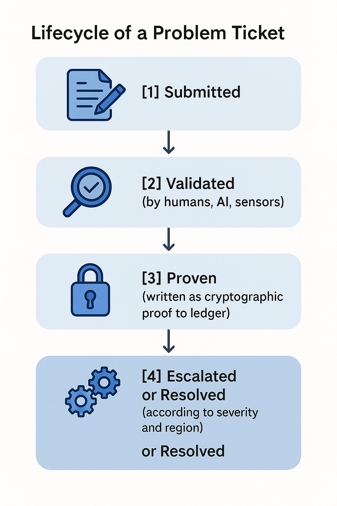

<!-- # 📘 Chapter 7: PoPP Core Architecture

---

## 🧠 What Makes a Protocol More Powerful Than a Platform?

A **platform** is built with **central control**.  
A **protocol** is built with **distributed trust**.

The **Proof-of-Problem Protocol (PoPP)** isn’t just software—  
It’s a **truth engine**:  
A layered system that **validates and escalates real-world issues**  
—without permission, without gatekeeping.

---

## 🧱 The 5 Core Layers of PoPP

### 1. 📝 Problem Submission Layer

- Users raise tickets through dApps (web, mobile, or voice-enabled kiosks)  
- Each complaint includes metadata:  
  `location`, `category`, `timestamp`, `optional evidence`  
- Identity can be **anonymous** or **verified**

---

### 2. 🔎 Validation Layer

- Validators (human, AI, or sensors) review the complaint  
- Context, reputation, and evidence are used to verify  
- A **minimum consensus score** is required to proceed  
- Disputes trigger **cross-verification**

---

### 3. 🔐 Proof Generation Layer

- Once validated, the issue is **cryptographically hashed**  
- It is written to a **distributed ledger** as a unique **PoP-ID**  
- Linked to similar past problems (to track recurrence)

---

### 4. ⚙️ Escalation Layer

- Issues are classified as:  
  - **Local** – handled by DAO/community department  
  - **Systemic** – escalated to broader levels  
  - **Critical** – triggers emergency protocols  
- **Smart contracts or DAO rules** dictate escalation flow

---

### 5. 📊 Reputation & Reward Layer

- Validators earn tokens or credits for **truthful validation**  
- **Bad actors** lose reputation or are penalized  
- **Whistleblowers** earn `PoPP Credits` or **Proof Respect Score (PRS)**

---

## 🔄 Lifecycle of a Problem Ticket

```text
[Submitted] → [Validated] → [Proven] → [Escalated or Resolved] → [Archived for Audit] -->


# 🧠 What Makes a Protocol More Powerful Than a Platform?
A platform is a tool you use within boundaries.
A protocol is a rule of coordination—independent, interoperable, and trustless.

While platforms rely on central entities (corporations, admins), a protocol like PoPP allows anyone, anywhere to participate in identifying, proving, and resolving real-world problems, without prior permission.

**Example:** Twitter can censor a post. PoPP can’t censor a valid, proven problem—only escalate or resolve it.

PoPP is not a digital suggestion box—
It is a truth engine designed to unlock trust without borders.

# 🧱 The 5 Core Layers of PoPP – In Depth
## 1. 📝 Problem Submission Layer – The Origin Layer
**Role:** Acts as the “entry point” to the protocol.
Who can submit? Anyone — individuals, NGOs, AI agents, or community sensors.

### Supported Interfaces:

- PoPP dApps (mobile, web, desktop)

- Voice-enabled kiosks or IVR bots

- REST or GraphQL APIs for automated systems

### Data Captured per Ticket:

- UUID – Unique problem ticket ID

- Timestamp – UTC standardized

- Geo-location – GPS or network-based

- Category – From an evolving taxonomy (e.g., Health, Infrastructure, Crime)

- Optional Evidence – Image, audio, video, IoT sensor feed

**Identity Type:**

Anonymous (privacy-preserving)

Verified (linked to decentralized ID, biometrics, or social proof)

Security note: All metadata is signed locally before being sent to prevent tampering in transit.

## 2. 🔎 Validation Layer – The Gatekeeper Layer
Purpose:

Filter out noise, false submissions, or duplicates

Increase collective confidence via distributed review

### Validator Types:

**Humans:** Verified PoPP validators from the community or DAO

**AI Agents:** LLMs, CV/ML algorithms for image or audio verification

**Sensors:** Edge devices for water quality, traffic, noise, etc.

### Mechanisms:

**Contextual Scoring:** Based on issue type, evidence, urgency

**Reputation-Based Trust:** Validators with high PRS carry more weight

**Cross-Verification:** If validation is inconclusive, issue sent to more validators

**Consensus Algorithm:** Hybrid of PoS (proof of stake) + PoA (proof of authority)

**Validation Finality Rule:**
An issue must reach a minimum consensus score (e.g., 75% weighted trust) to progress.

## 3. 🔐 Proof Generation Layer – The Ledger Layer
Once validated, the issue enters the immutable world of cryptographic truth.

### Steps:

**Hashing:** Entire ticket content is hashed using SHA-3 or Poseidon (zk-friendly)

**Ledger Entry:** Added to the PoPPChain (or any PoPP-compatible blockchain)

### PoP-ID Assignment:

**Format:** pop://{timestamp}/{region}/{category}/{hash}

Each problem becomes a verifiable object with audit trails

### Linking Similar Proofs:

Historical patterns detected and grouped via semantic similarity or graph linkage

**Result:** Anyone can independently verify this problem exists in a tamper-proof log.

## 4. ⚙️ Escalation Layer – The Action Layer
Not all problems are equal. This layer is where decisions are made.

### Classification System:

**Local:** Can be resolved by nearby users or city DAO

**Systemic:** Requires organizational, institutional, or regional attention

**Critical:** Triggers alerts, sends to emergency DAOs or public dashboards

**Escalation Paths:**

Automated via Smart Contracts: Based on category + severity + validator agreement

**DAO Rulesets:** Each region or domain has its own escalation criteria

**Human Override:** In emergencies, trusted human agents can fast-track

### Actions Triggered:

Notifications to civic bodies

Payouts to whistleblowers

Public display on city dashboards

Data sent to UN, NGOs, or watchdogs via API

## 5. 📊 Reputation & Reward Layer – The Incentive Layer
Without incentives, trust breaks. This layer keeps the system alive.

### Key Metrics:

PRS (Proof Respect Score): A composite score for validators, whistleblowers, and resolvers

**PoPP Credits:** Utility tokens earned for positive contribution

**Slashing:** Validators lose reputation or credits for false validation

**Reputation Decay:** Inactive actors lose relevance over time

Special Roles:

**Whistleblower:** Gets bonus PRS for high-impact early reporting

**Resolver:** Volunteers or institutions that act on validated issues

Economic Design:

Token economy designed to reward early detection, accuracy, and impact

Credits can be used for governance, priority escalation, or even converted via DAO oracles

## 🔄 Lifecycle of a Problem Ticket – From Noise to Action
In a world overwhelmed by misinformation, negligence, and bureaucracy, the PoPP lifecycle offers a structured, decentralized path to transform raw complaints into verified actions.

This lifecycle isn’t just about logging problems—it’s about trust engineering. Each step progressively filters noise, amplifies truth, and delivers justice without central gatekeepers.

Let’s break down the lifecycle stages:

### 1. 📝 Submitted
This is the initiation point where a user, sensor, or AI submits a complaint to the system.
The submission can come through a variety of interfaces—mobile app, web portal, kiosk, or automated API.

### 📌 Core elements included:

Time, location, category of the issue

Optional media evidence

Anonymity or verified ID

This stage is intentionally open. Anyone, regardless of status or power, can signal a problem.

## 2. 🔎 Validated
Once submitted, the issue enters a crowdsourced and algorithmic filter. This is the phase where truth and trust intersect.

### 📌 Validation actors:

Human Validators (from the community or DAO)

AI systems (for evidence checking)

IoT sensors (as independent signal providers)

If validators reach the required minimum trust score, the ticket moves forward. If not, it may:

Be flagged for dispute or further verification

Be rejected and sent back with a reason

This is where noise is eliminated and truth is curated.

## 3. 🔐 Proven
Once validated, the issue is written as an immutable, tamper-proof entry on the distributed ledger. It now becomes part of the global PoPP memory.

### 📌 Key elements:

Hashed metadata and evidence

A unique PoP-ID for traceability

Links to similar or recurring issues in the past

At this point, the issue becomes a fact, not just a complaint. It can now no longer be ignored or altered.

## 4. ⚙️ Escalated or Resolved
Based on severity, category, and region, the system routes the proven problem toward the appropriate action track.

### 📌 Outcomes:

Local DAO handles simple issues

Systemic problems are flagged for wider visibility

Critical events trigger smart contracts or emergency DAOs

Issues with quick resolution go to verified solvers

This is where truth becomes transformation—either by direct resolution or by alerting higher-order actors.

## 5. 🗂️ Archived for Audit (Optional final stage)
Every resolved or escalated issue is recorded for future audits, policy feedback loops, or statistical analysis. This ensures institutional memory and transparency over time.

## 🌐 Why This Lifecycle Matters
✅ Resilience: Works even if parts of the system fail

✅ Scalability: Can handle thousands of tickets per second

✅ Equity: Gives voice to the voiceless without bias

✅ Integrity: Proves the truth before any action is taken

This lifecycle embodies the PoPP philosophy:
Everyone can report. Only truth progresses. Action follows proof.


**Figure:** *The Lifecycle of a Problem Ticket — From Submission to Action, as executed by the layered PoPP architecture*.