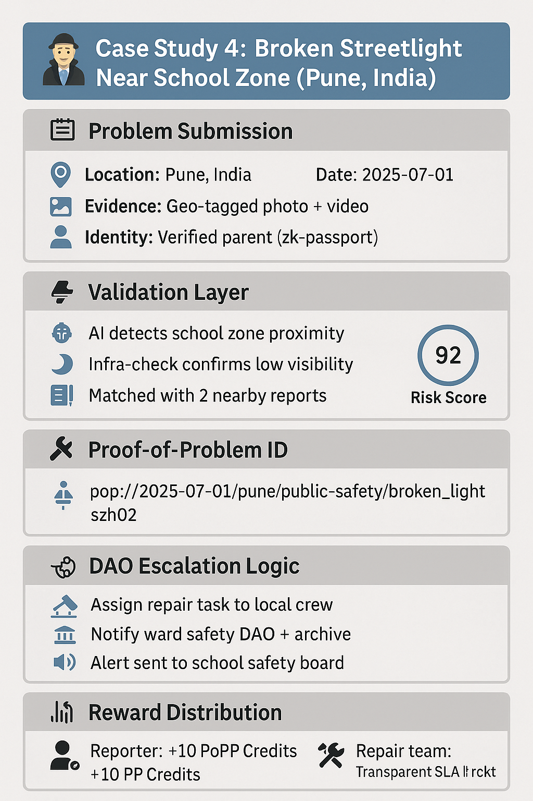

# 🕵️‍♂️ Case Study 4: Broken Streetlight Near School Zone
## 📝 1. Problem Submission Layer
📍 Location: Pune, India

📆 Date: 2025-07-01

📁 Evidence: Geo-tagged photo + citizen video

👤 Identity: Verified parent via zk-passport

## 🔎 2. Validation Layer:
Urban safety AI: Detects high-risk zone (school proximity)

Infra-check AI: Confirms night-time visibility hazard

Match: 2 similar reports from nearby streets this month

✅ Score: 92/100 → Prioritized as critical public safety issue

## 🔐 3. Proof Generation:
PoP-ID: pop://2025-07-01/pune/public-safety/broken_light_szh02

## ⚙️ 4. Escalation:
Type: Local-critical

DAO smart contract triggers:

Automatic task assigned to municipal repair team

Alert sent to ward safety committee

## 📊 5. Reward Layer:
Reporter: +10 PoPP Credits

Local DAO: Trust index +3

Municipal team: Repair response tracked publicly

**🕵️‍♂️ Case Study 4:** Broken Streetlight Near School Zone — A DAO-powered public safety response flow, from citizen report to repair team deployment and reward distribution.